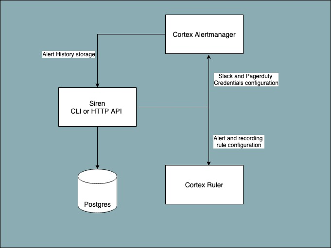

# Overview

The following contains all the details about architecture, database schema, code structure and other technical concepts
of Siren.

Siren depends on Cortex Ruler for actual rule creation. It depends on Cortex Alertmanager to setup its configurations
for proper alert routing and capturing triggered alert history. Siren stores templates, rules and triggered alerts
history in PostgresDB.

### System Architecture

The overall system architecture looks like:

Let's have a look at the major components:

- **CLI:** Siren CLI provides easy to use commands to perform various actions. Currently, the actions supported are,
  starting Siren Web Server, creating/updating templates and rules via a specified YAML file and migrating database
  schema. Read more about usage [here](../guides/overview.md).

- **Web Server:** Siren web server talks to Cortex alertmanager, cortex ruler and postgres DB to configure rules using
  stored templates and configure alertmanager per tenant with the stored credentials per team.

- **Cortex Ruler:** The configured rules are stored in Cortex Ruler. Siren Rules HTTP APIs call Cortex ruler to
  create/update/delete rule group in a particular namespace.

- **Cortex Alertmanager:** The stored slack and pagerduty credentials per team are stored as alertmanager configs.
  Whenever there is an update in any team's slack or pagerduty credentials, a fresh copy of alertmanager config is
  generated from the stored credentials and synced with Cortex Alertmanager. A predefined template of alertmanager
  configuration can be found [here](../../pkg/alert/alertmanager/config.goyaml). This also involves setting up alert
  history webhook receiver which is used to capture triggered alert history.

### Schema Design

Siren uses PostgresDB to store rules, templates, triggered alerts history and alertmanager configuration. Read in
further detail [here](./schema.md)

### Code Structure

Reference [this](./code.md) document to understand code structure in detail.
